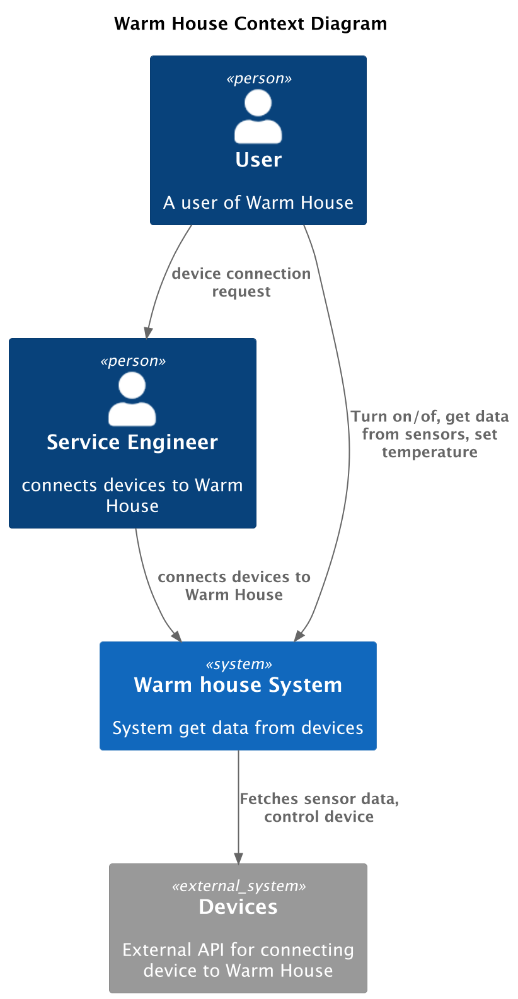
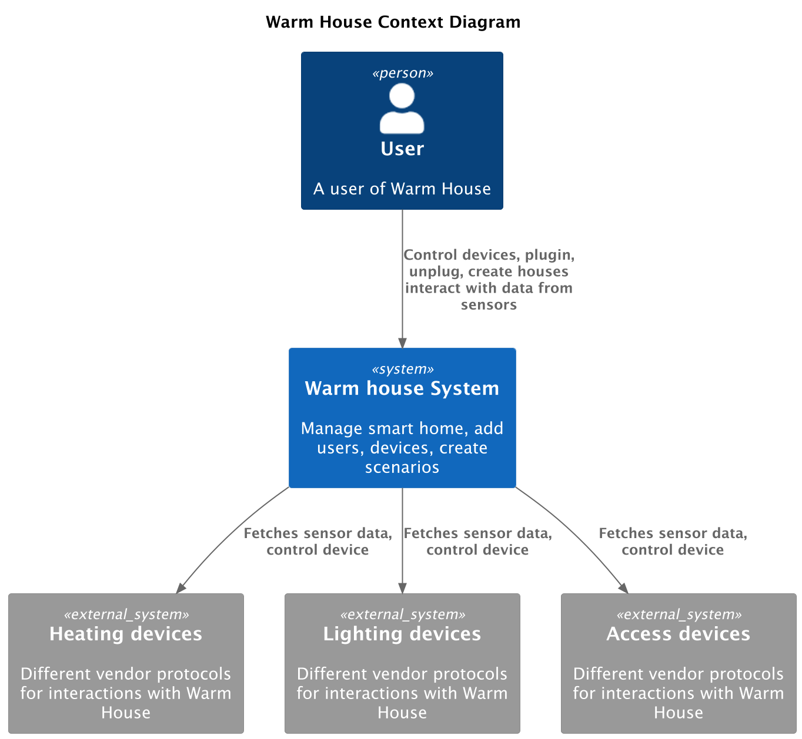
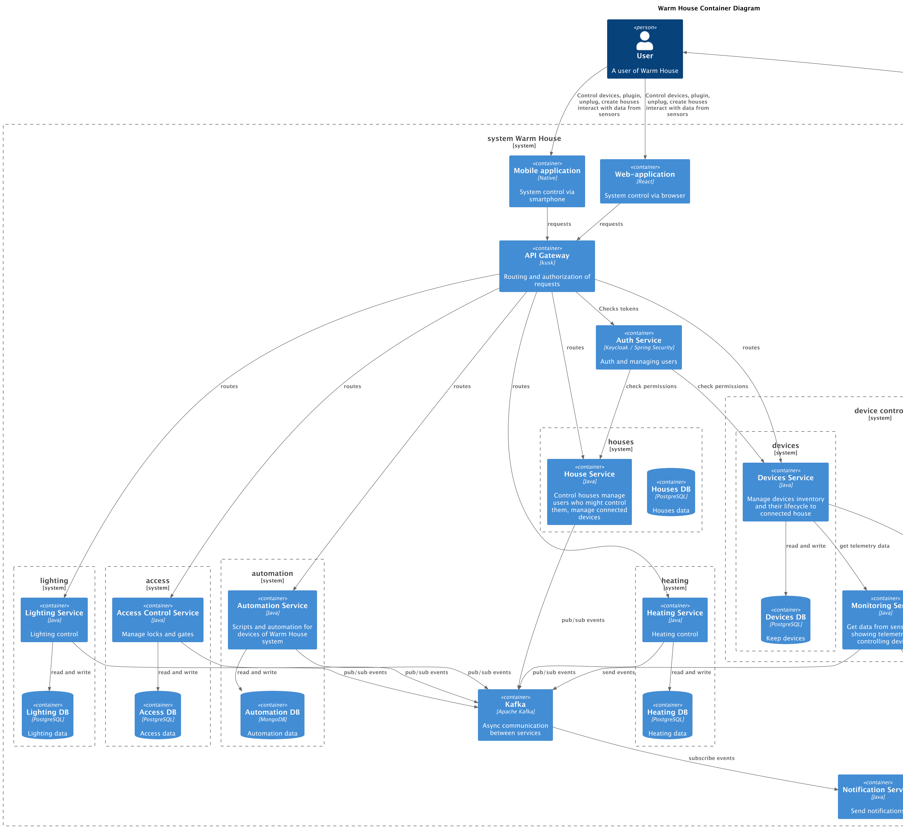
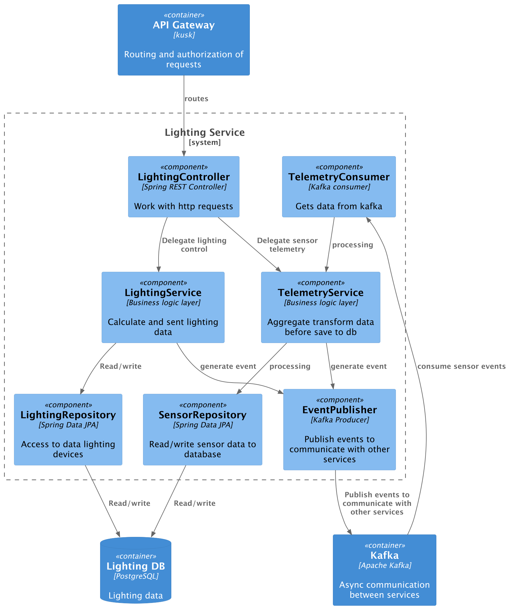
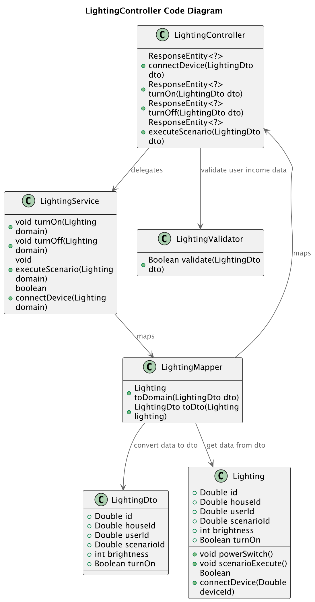
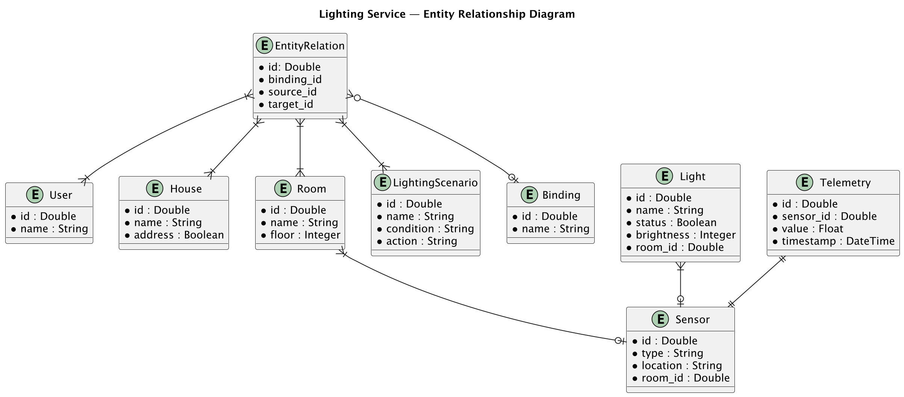

# Project_template

Тип: Материал
Родитель: Описание проекта для 11 когорты (https://www.notion.so/11-03abbbbc8bcb49ed9b85c9b6d1174056?pvs=21)

Это шаблон для решения проектной работы. Структура этого файла повторяет структуру заданий. Заполняйте его по мере работы над решением.

# Задание 1. Анализ и планирование

<aside>
💡

Чтобы составить документ с описанием текущей архитектуры приложения, можно часть информации взять из описания компани и условия задания. Это нормально.

</aside>

### 1. Описание функциональности монолитного приложения

**Управление отоплением:**

- Пользователи могут добавлять новое устройство с помощью вызова специалиста.
  Специалист каким-то образом вносит информацию об устройстве в бд. 
  В текущем приложении такой возможности нет. Так же подключают сенсор.

- Система поддерживает просмотр данных об устройстве: идентификатор, выставленную температуру на устройстве,
  информацию об устройстве включено или выключено.
- Система поддерживает установку температуры и включение и выключение устройства. 
  Изменение свойств устройства, как по отдельности, так и вместе.
- Система поддерживает просмотр текущей температуры устройства.

**Мониторинг температуры:**

- Пользователи в целом ничего не могут. Мониторинг температуры добавлен на уровне бд, 
  но никак не связан с управлением отоплением в текущей реализации.
- Система поддерживает получение данных с сенсоров, 
  однако это взаимодействие может происходить только на уровне бд и сторонних приложений.
  В текущей реализации есть сущность хранения информации получаемых с сенсоров, однако без связи с отопительной системой.
- Предусмотрен метод получения информации о текущей температуре, 
  данные хранятся в информации об устройстве нагревательной системы. 
  Однако, получение запись из сенсоров или методы записи текущей температуры, в целом отсутствуют в приложении.
  По факту получить температуру из системы отопления можно, но каким путем он попадает в базу данных, неизвестно,
  так как текущая реализация не поддерживает установки текущей температуры ни с сенсоров ни с отопления, 
  только просмотр, и в случае отсутствия внешних приложений с доступом к бд вероятнее всего температура будет равна 0.

### 2. Анализ архитектуры монолитного приложения

Архитектура приложения представляет из себя монолит на Java с СУБД Postgres. Микросервисы отсутствуют, хотя в текущей реализации монолита я бы его и назвал единственным микросервисом.
За основу приложения взят Spring Boot, что в целом хороший выбор для легковесных решений для которых нужен REST api. Используется JPA+Hibernate для взаимодействия с бд.
Есть две сущности, которые создают свои таблицы в базе данных. Система отопления([HeatingSystem.java](smart-home-monolith/src/main/java/ru/yandex/practicum/smarthome/entity/HeatingSystem.java)), и датчики температуры([TemperatureSensor.java](smart-home-monolith/src/main/java/ru/yandex/practicum/smarthome/entity/TemperatureSensor.java)).
Никаких связей между таблицами нет, уникальность только по id.
[HeatingSystem.java](smart-home-monolith/src/main/java/ru/yandex/practicum/smarthome/entity/HeatingSystem.java) представляет из себя информацию о системе отопления:
1. ид записи(возможно устройства, судя по обращениям к api)
2. устройство включено/выключено
3. выставленная температура пользователем
4. текущая температура.
[TemperatureSensor.java](smart-home-monolith/src/main/java/ru/yandex/practicum/smarthome/entity/TemperatureSensor.java) представляет из себя информацию о сенсорах:
1. ид записи, (возможно устройство, но если устройство нет истории о измерениях температуры, а если это запись, не хватает информации об устройстве с foreign key на таблицу системы отопления)
2. текущая температура
3. дата время обновления записи.

Есть dto для взаимодействия с клиентом по системе отопления [HeatingSystemDto.java](smart-home-monolith/src/main/java/ru/yandex/practicum/smarthome/dto/HeatingSystemDto.java)
мапится на [HeatingSystem.java](smart-home-monolith/src/main/java/ru/yandex/practicum/smarthome/entity/HeatingSystem.java) в бд.

Созданы 2 репозитория для взаимодействия с бд:
[HeatingSystemRepository.java](smart-home-monolith/src/main/java/ru/yandex/practicum/smarthome/repository/HeatingSystemRepository.java) для системы отопления.
[TemperatureSensorRepository.java](smart-home-monolith/src/main/java/ru/yandex/practicum/smarthome/repository/TemperatureSensorRepository.java) для мониторинга сенсоров.

Предусмотрен интерфейс([HeatingSystemService.java](smart-home-monolith/src/main/java/ru/yandex/practicum/smarthome/service/HeatingSystemService.java)) взаимодействия с api([HeatingSystemController.java](smart-home-monolith/src/main/java/ru/yandex/practicum/smarthome/controller/HeatingSystemController.java)).
и его реализация([HeatingSystemServiceImpl.java](smart-home-monolith/src/main/java/ru/yandex/practicum/smarthome/service/HeatingSystemServiceImpl.java)) которая используется в [HeatingSystemController.java](smart-home-monolith/src/main/java/ru/yandex/practicum/smarthome/controller/HeatingSystemController.java)

В реализации сервиса [HeatingSystemServiceImpl.java](smart-home-monolith/src/main/java/ru/yandex/practicum/smarthome/service/HeatingSystemServiceImpl.java) заложена
вся логика взаимодействия с системой отопления:
1. Получение информации об устройстве.
2. Обновление информации устройства вкл/выкл установка желаемой температуры.
3. Включение прибора
4. Выключение прибора
5. Установка пользовательской температуры
6. Конвертация entity в dto.

Для реализации api используется контроллер [HeatingSystemController.java](smart-home-monolith/src/main/java/ru/yandex/practicum/smarthome/controller/HeatingSystemController.java)
в нем прописаны все пути для и методы для взаимодействия с пользователями по REST api, и далее управление передаётся на сервис 
[HeatingSystemServiceImpl.java](smart-home-monolith/src/main/java/ru/yandex/practicum/smarthome/service/HeatingSystemServiceImpl.java).

Документации swagger нет.
Контроллер взаимодействует только с [HeatingSystemServiceImpl.java](smart-home-monolith/src/main/java/ru/yandex/practicum/smarthome/service/HeatingSystemServiceImpl.java), нет никакого взаимодействия с датчиками температуры.
Информация о ресурсах в [application.yml](smart-home-monolith/src/main/resources/application.yml):
1. местоположение postgres логин пароль, использование хикари для пула соединений к бд.
2. настройка jpa для postgres.
3. установка запуска скриптов для развертывания таблиц в бд [init.sql](smart-home-monolith/src/main/resources/init.sql)

Реализованы тесты на проверку работы api.

Текущий проект предполагается к развертыванию на k8s, через terraform.
Настроены хельм чарты и зависимости, например postgres для запуска приложения, предполагается использование api-gateway
однако из проекта я не понял для чего, т.к. его настройка не приведена.
Так же terraform предполагает использование кафки. Автоскейлинг пода от 1 до 100.
Для реализации развёртывания в k8s предусмотрен [ci.yaml](.github/workflows/ci.yaml) для пуша
сборки приложения в репозиторий пользователя. В самом приложении [Dockerfile](smart-home-monolith/Dockerfile)
прилагается. Для чего это все используется в монолите не представляется возможным сказать, 
возможно расширение на реализацию предполагаемого микросервисного подхода.

### 3. Определение доменов и границы контекстов

Домен авторизации и аутентификации - авторизация и аутентификация пользователей в системе.

Домен управления домами - добавление нескольких домов, 
добавление к домам новых пользователей выделением им прав на управление домом, добавление устройств экспорт импорт сценариев.

Домен управления устройствами - инвентаризация устройств подключенных к умному дому, их состоянием и жизненным циклом.

Домен управление сценариями - настройка сценариев, взаимодействия между устройствами, в зависимости от внешних факторов. 
Например, если температура ниже 10 включить подогрев. Если уже темное время суток, включить уличное освещение.

Домен мониторинга устройств - мониторинг информации с устройств(телеметрия), сбор информации с устройств и датчиков. 
В зависимости от устройства, если нагревательный прибор то t, если лампочка то можно время работы и напряжение.

Домен интеграции с устройствами - технический домен отвечающий за поддержку, интеграции новых устройств и производителей.
Отвечает за возможность расширять список устройств, которые можно подключать к умному дому. 
Работа с производителями устройств для поддержки интеграций.

Домен уведомлений - для нотификаций пользователя, и внешних систем, возможно и нотификаций между сервисами.

Домен управления отоплением - управление отоплением, типами устройств связанными с ним, управление сценариями.

Домен управления светом - управление светом, устройствами связанными с управлением освещением и сценариями.

Домен управления доступом - управление доступом, входными группами дверьми воротам,
назначение прав на возможность входа, подключение устройств замков, настройка сценариев, например, включение освещения.

### **4. Проблемы монолитного решения**

- Скорость разработки - скорость разработки у монолитного решения может быть весьма низкой, 
  из-за тесных связей между компонентами кода, частично это проблему может решать модульный монолит, 
  чтобы разделить домены, над которыми работают команды. Цикл разработки классического монолита может приводить  
  к достаточно долгим релизам с откатами, из тесных связей между доменными областями.
- Масштабируемость - монолит может быть весьма тяжко масштабировать, при выявлении проблемы в домене придётся
  масштабировать весь монолит, вместо конкретной доменной области.
- Скорость релизов - у монолита скорость релизов весьма низкая, изменения в одной части кода могут влиять на другие. 
  Усложняется процесс тестирования, релизов, сложность реализации AB тестов и канареечных релизов.
- Расширение функциональности - монолит сложнее поддерживать и доставлять новые возможности, 
  порой ввод новой функциональности может оказаться даже экономически не выгоден.
- Сложность командной разработки - если команда большая, то разработчики могут мешать друг-другу в процессе разработки, 
  в том числе из-за моно-репозитория
- Отказоустойчивость - если монолит упадёт, то вся функциональность скорее всего будет недоступна, что может привести к
  высоким издержкам бизнеса.

Хочется отметить что в текущей реализации монолит хорошее решение, без дополнительных расходов на инфраструктуру 
и поддержку правильное решение в идеале реализовывать на старте монолит(возможно модульный монолит) и далее переходить к
микросервисам при расширении(что отчасти и было реализовано в as is). 
В нашей ситуации где есть несколько команд разработки, команда девопсов и желание 
расширятся добавляя новые функции, это хороший момент для перехода к микросервисной архитектуре, кажется что кадровый 
состав компании частично нивелирует проблемы миросервисов, т.к. есть несколько команд разработки, если команда девопсов,
команда тестировщиков, кажется компания готова нести больше издержек на инфраструктуру в угоду быстрой разработке и 
надежности. Самое сложное с чем столкнется команда при использовании микросервисов это с конситентностью данных, однако
использования асинхронных методов связи в совокупности с паттернами проектирования микросервисов могут решить и эту 
проблему.

### 5. Визуализация контекста системы — диаграмма С4
[Ссылка на диаграмму as is](https://www.plantuml.com/plantuml/uml/XP0nJyCm48Nt_8eZKv5Aip2nLMqHI82gbegnCiabiUJumla2vTzpJbArq879rZk_p--UM748RuORUA0k82p82nu4bjPKR9ea4Mf12Dv9X1eeB6CkbdoIN5cVkwx0ZXtK8csuop8sNxFAIjszAulpoF8oowd9DZOtND2BnHPTjhYzMJlZPVVyb3Kc2B9A-mKrBVdeQBl69SaQEP2VHDGKqfqUgPvpY09GUHOxlJu-rj6dpN7bA-knzsq71OvIP6Wohti4A33EGjpm5stxhQ6QITHwIJtzlEvB6gOHDDoWGe72Y86IOqa3L34ZPxywoCIqLWtBSQPN5P6zSJ1VFq9936CgwwiHSH4hIJRena8kDnrDHmnvOFpeC8Wwe-_2SRxUlvMSVZwtlNRiWNn6vVHF2m5z80ung82Mq28RwVY8Ea5YCUazIbxhhuEhnqpZ9iBanaXg_040)

[Ссылка на диаграмму to be](https://www.plantuml.com/plantuml/uml/jLB1JXmn3BtdAzmzRQKjS-7K6rgeE012L8WZCXdFJAGa7ZaUe7zV9xjTjceFLGMdEBRVU_5pD6WaU419SCbB8TXoLdfLE0yu2YRdb6TGXYTMvGHz4F8QE3ltAMGVbvuMYJ2fpkLhrmc-d8n1f-N9kCHNhgmddbDt5pnAppU1PehTzlJBRSIizzTNNSAY99Pwt7AQELV4lAJet2r9uRokL1jOtTknilCCQW9uE7hswhFx_iDeqhhcMiewMtrgO-sg5NwD6KU2ab3KYiaQiUyRPzb0Jy_1amLU2DNQF6MKmCKKzXAF5w-wdgmQycXybxle5x9Ad8TX8B4vu9bopmApiBBdM62mMp1N19kB1LxChRyDqbHY6AUzpDK-_10TzCPOghSjU3yDv-uexXTul9dwouJZczrpNCQGDx3a6XtiRyih1vMTGe-AC8ZznaAviDJTL9atWSDsOFMDr4z6iMjjM6F_JVuF-97j_mC_kFblu9y0)

# Задание 2. Проектирование микросервисной архитектуры

В этом задании вам нужно предоставить только диаграммы в модели C4. Мы не просим вас отдельно описывать получившиеся микросервисы и то, как вы определили взаимодействия между компонентами To-Be системы. Если вы правильно подготовите диаграммы C4, они и так это покажут.

**Диаграмма контейнеров (Containers)**

[Ссылка на диаграмму контейнеров](https://www.plantuml.com/plantuml/uml/jLTBSzis4BxhLw0-EJEsDMtJfjDROxL96hlZH9F9qGDIAn4Z4c01K8hIyN_luWs-v1vINKGI7xvzxmAQwHh8PoeRybPq2iYju9eo3fAi6Dr9sYmMtp5Urjq6EbcJIkjM_RfSIdgysJ5TTGLkaYLk0gvlIj4isvfotJNrjTARcXNBsvVN3-RJf_kxPKEL1ecV7gEOcnQnYyK3I2NufI6x8XUVyEy2_tyZvWCHsqp3YnUBnVg4FCtZQz7n3PMdI_KzWfNzs4EIVnOBaaowF4A1mCzGNDEshLb9DHFS2Fe8jDJcmJ4JOv0KDJamIWefZaQV5psgHXIi1jnnRn_8WF0lV3h03ADggDHj9JWCI6dBtb0DHteonZ-y8_xDyEmxjRUgYauplYEKRmZjT2Ka-sh56ZT9-Bi3fPLnKeyOWOOI_yWQv86LLhVtS2fhGVTaITQjDAnhA3l9j9LeqKPCGpdTcLKJZH4t5vfjlUd6ykmrb_KdFL3h3q36V8yd7CNq1mJNR5SPQsqeYVybqM4PaNV-SKfaNFD1i5uVSAsAoBOgyZshruRYGIYzax3-SDSZt51DBTlJb0K_8fIM9IWrexzRDAws3tR59Cc43VSc1a1gKUwL3SeEKqFDME9uhHsUUSeAltJUXfS8h83sWf0Cy2k8UUkUfbGFIttlv_fw6gjmG4zf7DREg_oJSNkdHUEgCRc-Lmz-sUMvVvdCrrAoLgjGRm6v5P9im81LlpyHruTYP7fnYVjTR1ATi_PUy9rmZzdQUMj_DW4oWkUIp2qQxrdr9amCQUUGhjp15JivLe8q9jrZ1zCLD5S1X1yvb1esmHap6UceNO2TbCdukgNp1hz2e1EMCYeQFaB_4j5p_l6hY5lvUCwNNuWuumUSTqAUR5gWHvWaDTj2YVqKY1QPNoe_jAQyukciMuBmAR-y1sX73duQr2B36Om3soVrk_JcTqwPzGQqzJRPIj4Gj6aZCEP9_u7GVFnnXlQxsh-FBy_BKC2LaM7gHrNYQ3PfgA41xRtfWrhRGi_4F_N7pfvkzzJunlpRYcbfMG59x-h4IsHhcew7ULI0FW9mr486OYJz2BKx6lJcRpPB7IIC_3cKX-NBVkxULc3QjXPxu8al1yOYbJZUOHgJ4lKCA7NaCw1iRfv1nUbq3fCtqeZpmAXmdkSIwCR6-OZd38YaKUzy5inWa_gzaJs33cPaGt4EcHapQDMZ7KCJUmMnmvHFIHtRcKkYX0ifhCoH24n7IKwEnFsoXYzbHNdiH9PRLG0wgHGz6UZRhbYghXXA27vv1XOoynbOYibpOZCdpq8zrgyFJfY8L3YK2nZXNRcbEYbDtP4MPCEKyaVD71chRWhu5EyPlt_HmQkFZZm_Y_WMPLeussv1eag-av9M2YrAKRjsPo8fyPvX-CaHBq_zMqqcB3WpIKidplz1dCk492mS3B-Lg8NnkBlQkHjOE734IBLrXnUCAz9nytH5Igmt3U504kWTzMYMe8Ga8DxBlhaCAwHNZSES60hrYlNsZ4Fx_9vXV4Ox5iFECjRi3z2OvChR4thISDzOk_-sRwZXz2wxhL_C_i8_TIdy5m00)

**Диаграмма компонентов (Components)**

Диаграмму компонентов по уточнению наставника, 
нужно разобрать на одном микросервисе в моём случае использую микросервис управления освещением.

Lighting service
[Ссылка на диаграмму компонентов Lighting service](https://www.plantuml.com/plantuml/uml/dLFBRjim4BpxArYV7229KQ2dtXmx2DgwW2kbw36WgBLCc2BL9Mb3BVhl9IbAeXyDWleYSrypExlxZaicR0aM1TaPq-YFypdIutt5pSuMLWCo9Gr8SyzKFMy4bSRMuawRKl1Yllnmj_6cxr_Nyvfg0-XCBqjLDqhwdCR5JYPBLu5o2JYZ3N-Y1ewqlINJnUOJYQ-fU-wjtljlfgpXiY9KbeHQirF8Vr73bIHgIn1-Mj16JsycaxnrWFNBWxAofDZEz7kNlURLBgJdW0VEO7f3Va-8-msaF8aaq9D39GIW1yyRzCdPO_vCJZq_5Ex9qQaIP4g9d5RN7Mw2q3DnfWUhdGvQ4w4gpeYWRLTyIGMpmcaHkjQk3X5z8oKrz0B5W80Q3BRv0FTyPdeDRr5L29N7CqYbtYgi0mufmFq7ekd1kHGfYmjaX4ObpMNkgRbHs2RohNofpvj5W6BC4_35l7Li2pp9I_tsTBkdJdfjQy2qhTxcYtxnGOID5Z9z0gCxY2sgceGoLuOZjSAiQo4V7gysa04jvqVaJgmklKE93HLKm_KUDgXAoq8FZmTdtTX2SBrB6-X3l2Mw2VZOe9SxkDfAploOmk8fux99N32lt9_ajbR5hDTsLQI7i7e8vPKsRkRvj_KqTSRb6YyqKEy9XlarbEs0Z6_TIfPmyuTPW3a2o9JQ90DnSkxTrQ4xxk2FxbiotilAJJhivB0ZhBl0DFpAuWzvSJn3ICmR4Cx7Ke7hs2S6pMFqsVvTmMjG-PLs16FAPSp9dhqX_atCXZxY2OwBcLAFnP8BYcVIozCjM9eo0lVJ_vzbzEKwPYTxUC4orUQVaNy1)

**Диаграмма кода (Code)**

Диаграмма кода на примере LightingController 
[Ссылка на диаграмму кода LightingController](https://www.plantuml.com/plantuml/uml/lLHDRzGm4BtxLvXRAxJDXLE4YjHD3vLQG5t15JdsR6B9zaJsP1U4-E_O-LZSR5hAXLiyVZFptinpI9C1Vg-RbhHhjkZ8ep7W-HOLy4gBnWlB66772NcDH6YvqXuaQNIClT5Ecbv1xmrlYRfG5eKNnwj6KzlNVG0lOqrmT2NH5ezQ2g_meuOEJB5zj_biXACl3_U55O70nz2tBTeENSheUciOaqQ4iCRm9-FyxIE4Y0vmwqZJZ_SVhddivoAx2WvQmiMSLqNsYl1oFOTwxpwvVm7lzwz4mtUGFS5EWXDUutdMhwN47VX4VTHtGAsMzBX2AxIxV7gVCJe3F4SY1zQ81eHxPdudv1dT96IWMc5VHozfbHrQZ1QuooF94ay2OI8r1hKZNljKsa48AN8pyHg7aFel27mLHYj1E3bYnX_6CBnYuW-YwsP3dGGJLeFarJtdiGYaRAHc-bZfyp_dDA--moFutL6JR2_-668kTZiQOxovMNN0r5uDfpiro68hpt6pkLvPINdQmw28nzy5sbXDa62ByUS5ihebjw8BV-iuFveo4ZNGn7w1PJnNMaHe0pGmuNkV_cg4B-7JgiiqcmFuAMqq15jooBEcGgE8tm00)

# Задание 3. Разработка ER-диаграммы
Тут некая реализация EAV, хотя можно обойтись отдельной таблицей на связь, или же вообще jsonB, без доп таблиц.
[Ссылка на ER-диаграмму](https://www.plantuml.com/plantuml/uml/bLF1QiCm3BtdAqmlWq5-OCVIZGrsMhfpSHCjDJXMiPL2QGhxY7tXlcIMtAn9IqPtavwYzvuLYGnPKA-ctf1njIh0xqm9wllpIpqwChHNRs0r6NHXOxPgONJjTPDba8gpzm1-fdHG7AX3fjIzCfLwK0jirnOaTxg1Y1JaeqHsF3S_Onj0kYMwgPqHNLKUGeZW7D62TaFIDyH6E3cucVB38le8lJY26loGK8OZZ1BTJ1b8KpiqoU3QCuTBxdinBlZeTZKa7JWem0LCOqxXX0VQRoyyM2pbvutHlxIMOA41ydkH-yqc58FOMLt2EsrRTl9aKLEoPXg80scs_A4cMCRyQiZHNr62qzvWUkmfkNda9RhANBzNbsDie3itiSFL8dUA_xl5wKxwCn6cCSI4p7UcYtkGjEBaE0lO-X9E2MbV0t4IHUv6znUo2-OZvZbslVEhQfVdtK4EOQB4LpjHafESgFK_9fCROp2QIAkPfICPO-SrwfYWnty0)

# ❌  Задание 4. Создание и документирование API
Пропускаю.